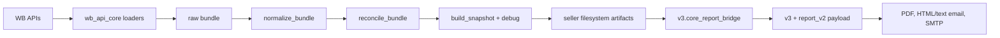

# AI Director 2 Implementation Plan

## Status and Scope

This document records Stage 1: architecture, contracts, migration boundaries,
and the implementation order for AI Director 2. It is a planning artifact. It
does not move, rewrite, or delete legacy code and does not introduce a new
business calculation.

The authoritative target is `AI Director 2/`, its architecture blueprint, and
the accepted ADRs. Repository-root modules remain legacy even when they are
actively used by the current production route.

The existing `wb_core_snapshot_v1` golden fixture is the baseline contract for
the first migration slice. It is synthetic, manifest-hashed, and must remain
immutable except through an explicitly reviewed fixture version change.

Stage 3 defines the first target raw-to-canonical contract in
[`CANONICAL_NORMALIZATION.md`](CANONICAL_NORMALIZATION.md). It is intentionally
limited to one synthetic `sales_funnel_products` source slice and has no
reconciliation or finance behavior.

Stage 4 defines the separate [Reconciliation Contract](RECONCILIATION.md) for
canonical operational facts. It retains source values and explains their
relationships; it does not implement Finance Kernel behavior.

Stage 5 defines the Decimal-only [Finance Kernel Contract](FINANCE_KERNEL.md).
It is contract-first and deliberately contains no production finance calculator.

## Current Architecture

### Target shell already present

`AI Director 2/` currently contains a deliberately small platform shell:

| Area | Current implementation | Status |
| --- | --- | --- |
| API process | `apps/api/main.py` FastAPI health and readiness endpoints | shell only |
| Worker process | `apps/worker/main.py` diagnostic worker shell | shell only |
| Common contracts | health payloads and non-secret settings in `packages/common` | reusable foundation |
| WB boundary | `packages/wb_core/contracts.py` defines `TenantAccountScope`, `RawApiEvent`, and `WBReadClient` | contract only |
| Compatibility | `packages/compat/legacy_snapshot_parity.py` | implemented migration-only replay harness |
| Architectural protection | `tests/unit/test_migration_boundaries.py` | implemented |
| Infrastructure declaration | `docker-compose.yml`, project dependencies, `.env.example` | declared, not connected |

No target package currently performs a WB request, persists tenant data,
calculates business metrics, renders reports, invokes an LLM, sends a message,
or performs a marketplace write action.

### Current legacy runtime

The active scheduled path is defined by `.github/workflows/daily.yml`:

```text
wb_api_core.run_daily
  -> WBApiClient / loaders
  -> raw bundle
  -> normalize_bundle
  -> reconcile_bundle
  -> snapshot.json + debug.json + reconciled_rows.json
  -> v3.history.api_history_backfill
  -> v3.entry daily
  -> input -> metrics -> AI -> output
  -> report_v2 payload -> PDF + email render files
  -> SMTP delivery through src.mailer_yandex
```

The significant legacy areas are:

| Legacy area | Current responsibility | Observed concern |
| --- | --- | --- |
| `wb_api_core` | WB HTTP, retries, loaders, normalization, reconciliation, snapshots, artifact/cache files, price history | first compatibility candidate; most snapshot values are float-based |
| `v3` | daily orchestration, local/API input, metrics, finance kernel, analytics, AI decisions, history, report orchestration | dynamic `sync_from_entry` imports create undeclared stage dependencies |
| `report_v2` | report payload, PDF, HTML/text email artifacts | builder reads secondary files beyond the passed snapshot |
| `src` | previous daily path, direct WB client, finance/COGS utilities, AI clients, SMTP, action suggestions | contains active dependencies of newer `v3` code and a deprecated workflow |
| `audit` | separate spreadsheet-driven WB/Ozon audit route | marketplace/product scope is unresolved; not part of the first WB SaaS slice |

The deprecated manual workflow still invokes `src.main`. It must remain a
legacy runtime consumer until a separately reviewed retirement decision.

## Target Architecture

The target is a modular monolith with explicit contracts and background jobs.
The intended flow is:

```text
API / scheduler / manual command
  -> sync job
  -> packages/wb_core transport and raw provenance
  -> packages/data normalization and canonical facts
  -> domain packages
  -> reconciliation and finance kernel
  -> analytics read models
  -> reports / API / notifications
  -> AI recommendations using derived evidence only
  -> automation only through policy, approval, dry-run, and audit
```



```mermaid
flowchart LR
    Entry["API, scheduler, or manual sync"] --> Core["packages/wb_core"]
    Core --> Raw["Raw payload object store + RawApiEvent"]
    Raw --> Data["packages/data: validation, normalization, canonical facts"]
    Data --> Reconcile["packages/reconciliation"]
    Reconcile --> Finance["packages/finance: Decimal kernel"]
    Data --> Sales["packages/sales, inventory, advertising, products"]
    Finance --> Analytics["packages/analytics read models"]
    Sales --> Analytics
    Analytics --> Reports["packages/reports"]
    Analytics --> AI["packages/ai_director: evidence-based analysis"]
    AI --> Recommendations["packages/recommendations"]
    Recommendations --> Automation["packages/automation"]
    Automation --> Policy["policy + approval + audit"]
    Reports --> Delivery["API, PDF/HTML, notifications"]
```

Target principles:

- Raw WB responses are immutable, tenant/account scoped, versioned, hashed,
  and timestamped in UTC.
- Normalization maps source schemas to canonical facts; it does not own finance
  formulas or report presentation.
- Operational data and financially closed data remain distinct inputs with
  explicit freshness and completeness statuses.
- New monetary domain values use `Decimal` and persistence uses `NUMERIC`.
- The WB business day is resolved in `Europe/Moscow`; event timestamps are
  stored as UTC.
- AI consumes derived read models and evidence references, never credentials or
  raw WB payloads as an authority for a metric.
- Write actions are denied by default until policy, approval, dry-run, audit,
  and an explicit write adapter exist.

## Legacy Boundaries

### Permitted dependency direction

```text
target application/domain package -> target interface -> packages/compat -> legacy
legacy -> target package                           prohibited
target domain package -> arbitrary legacy import  prohibited
```

`packages/compat` is the only target-side package permitted to resolve legacy
imports. The existing parity harness satisfies this rule by lazily importing
only `wb_api_core.normalize`, `wb_api_core.reconcile`, and
`wb_api_core.snapshot` for a synthetic fixture replay. It performs no network
I/O and writes no artifacts.

The static boundary test must continue to reject direct imports of
`wb_api_core`, `v3`, `report_v2`, and `src` outside `packages/compat`.

### Boundary conflicts to preserve, not silently fix

| ID | Observed conflict | Required treatment |
| --- | --- | --- |
| LB-01 | `v3.pipeline.*` stages call `sync_from_entry`, which injects names from `v3.entry` at runtime | preserve in legacy; replace later with explicit target interfaces before extracting a stage |
| LB-02 | `v3.core_report_bridge` addresses seller files by repository path | preserve bridge behavior behind a target snapshot repository adapter; do not make filesystem paths a target domain API |
| LB-03 | `report_v2` discovers history and secondary artifacts adjacent to a snapshot | model every required secondary input in a future report fixture/manifest before report extraction |
| LB-04 | `v3` finance and financial snapshot models use floats for money | do not copy formulas into target code; establish Decimal input/output contract and approved finance parity first |
| LB-05 | `v3` still imports `src.cogs` and the email path imports `src.mailer_yandex` | keep as legacy coupling until new finance and notifications interfaces have parity and production consumers are migrated |
| LB-06 | three extra direct WB client implementations remain in `v3` and `src` | prohibit new consumers; deprecate only after target WB Core parity and caller migration |

## Module Map

### Existing code and destination

| Existing component | Classification | Target package/interface | Migration condition |
| --- | --- | --- | --- |
| `wb_api_core.client`, `loaders` | Adapt | `packages/wb_core` transport, endpoint registry, rate-limit/error contracts | tenant scope, credential boundary, provenance, idempotency, and endpoint fixture tests |
| `wb_api_core.normalize` | Adapt | `packages/data` normalization ports | per-source canonical-model and fixture parity |
| `wb_api_core.reconcile`, `snapshot` | Adapt | `packages/reconciliation` and versioned snapshot/read-model contract | explicit metric ownership and reconciliation fixture parity |
| `wb_api_core.artifacts` | Adapt | `packages/storage` repositories | no business code depends on filesystem layout |
| `wb_api_core.pricing` | Adapt | `packages/products` and `packages/data` | Decimal/NUMERIC history and query parity |
| `v3.domain`, `source_policy`, validation | Adapt/Keep logic | domain contracts and `packages/common` data-quality policy | source-state semantics covered by target contract tests |
| `v3.financial`, `v3.metrics.financial_kernel`, `src.cogs` | Adapt | `packages/finance` | approved finance ledger, Decimal model, closed-period reconciliation parity |
| `v3.metrics.sales_funnel_assembler` | Adapt | `packages/analytics` funnel service | source semantics and denominator-state fixture matrix |
| `v3.metrics.ads_summary_assembler`, advertising efficiency | Adapt | `packages/advertising` plus `packages/analytics` | separate spend ingestion from attribution/read model |
| `v3` stock/order/sales calculations | Adapt | `packages/inventory`, `packages/sales` | canonical event/fact contracts and idempotent ingestion |
| `v3.analytics.*` | Adapt | `packages/analytics` | each derived metric has an identified owner and golden tests |
| `v3.decisions`, `src.analysis.ai_director` | Adapt | `packages/ai_director` and `packages/recommendations` | evidence, confidence, tenant scope, and persistence contracts |
| `report_v2` | Adapt | `packages/reports` | pure payload contract then semantic/visual renderer parity |
| `src.mailer_yandex`, v3 email orchestrator | Adapt | `packages/notifications` | audited recipients, provider interface, and no-secret logs |
| `src.action_orchestrator` | Reuse candidate only | `packages/automation` | policy, approval, dry-run, audit, and write-adapter controls |
| `v3/api/wb_client.py`, `v3/wb_client.py`, `src/wb_client.py` | Deprecate | none | all callers use target WB Core and endpoint parity is accepted |
| `audit` Ozon path | Target unclear | none pending product decision | explicit human decision on separate product, adapter, or sunset |

### Target modules to introduce in later isolated tasks

| Target module | First responsibility | Must not own |
| --- | --- | --- |
| `packages/tenancy` | tenant/account server-side scope | credential plaintext or metrics |
| `packages/storage` | raw object references and repositories | normalization rules |
| `packages/data` | raw validation, normalization, canonical facts, idempotency metadata | finance formulas, presentation |
| `packages/reconciliation` | source alignment and controlled comparison | finance calculation policy |
| `packages/finance` | Decimal finance facts, component ledger, closed-period reconciliation | live operational orders/funnel ownership |
| `packages/sales` | orders, sales, returns facts | financially closed settlement totals |
| `packages/inventory` | stock snapshots, warehouse facts, coverage inputs | revenue calculations |
| `packages/advertising` | campaigns, spend, performance facts | open-count/funnel semantics |
| `packages/products` | product catalog, price and cost history | report rendering |
| `packages/analytics` | derived read models and anomaly signals | raw WB transport and finance source mutation |
| `packages/reports` | versioned report payload and renderers | metric recomputation |
| `packages/ai_director` | tool orchestration over derived facts | financial truth or write execution |
| `packages/recommendations` | recommendation, evidence, confidence, lifecycle | WB writes |
| `packages/automation` | policy-controlled executable requests | bypassing approval/audit |
| `packages/notifications` | delivery provider adapters and delivery audit | financial calculation |
| `packages/compat` | temporary legacy adapters and parity harnesses | permanent domain logic |

## Data Flow

### Current artifact flow



The same operational view must not be confused with finalized finance:

| Contour | Existing source examples | Target rule |
| --- | --- | --- |
| Operational | orders, sales, stocks, sales funnel | current-business-day facts with source freshness |
| Financially closed | detailed finance rows, payout components, taxes | actual accounting date, finality and alignment status |
| Derived | funnel rates, profit contribution, diagnostics | computed only from named owner contracts |
| Presentation | report payload, PDF, email | reads a versioned read model; never recomputes business truth |

### Target contract flow

```text
RawApiEvent
  -> RawPayloadRepository.get(event)
  -> SourceNormalizer.normalize(payload, source schema version)
  -> Canonical facts with source, event-time, loaded-at, quality state
  -> Reconciliation result with target date and actual source date
  -> Finance kernel or analytics read model
  -> Versioned API/report/recommendation payload
```

Every canonical/derived value must retain enough provenance to answer:
source endpoint and version, raw event hash, loaded-at UTC, target business
date, actual source date, freshness/finality, and completeness state.

## Domain Boundaries

| Domain | Owns | Reads | Explicit exclusions |
| --- | --- | --- | --- |
| WB Core | authenticated read transport, endpoint policy, raw event provenance | account scope and encrypted credential interface | business aggregation, report formatting, write actions |
| Data | source normalization, canonical facts, deduplication, ingestion quality | raw payload repository | finance formulas, recommendation text |
| Sales | orders, sales, returns canonical facts | normalized source events | final finance settlement |
| Finance | finance detail facts, component ledger, COGS allocation, period reconciliation | finance facts, product costs, approved tax policy | live funnel and raw HTTP |
| Inventory | stock snapshots, warehouse facts, coverage inputs | normalized stock and sales facts | revenue/final payout |
| Advertising | campaign/spend/performance facts | normalized ad events | auto-bid execution and funnel open-count ownership |
| Analytics | funnel, product, financial and quality read models | domain outputs | raw parsing, source mutation |
| Reports | payload schemas, PDF/HTML/CSV rendering | analytics read models and report metadata | metric formulas |
| AI Director | grounded analysis and tool calls | derived facts, evidence, confidence | raw credentials, raw financial calculation, write execution |
| Recommendations | proposed action with evidence/confidence/status | analytics and AI structured output | direct WB write |
| Automation | policy evaluation and approved action execution request | approved recommendation and account scope | bypassing approval/audit |
| Notifications | audited delivery attempts | report/recommendation payload | financial calculation |

## Metric Ownership

The following ownership is binding for target design. A future implementation
must not create a second independent computation for any listed metric.

| Metric family | Single future owner | Inputs | Contract notes |
| --- | --- | --- | --- |
| WB raw request status, attempts, API version | WB Core | transport events | provenance, no business interpretation |
| Orders and order amount | Sales | normalized orders and declared operational date | distinct from finance realization |
| Sales/buyouts and amount | Sales for live facts; Finance for closed realization | normalized sales; finance detail | consumer must declare which contour it uses |
| Funnel opens, carts, conversions | Analytics/Funnel | sales-funnel canonical facts | `card_opens` means WB `openCount`, never ad impressions |
| Stock units and coverage inputs | Inventory | stock facts and sales read model | live snapshot date is explicit |
| Finance revenue/payout/commission/logistics/storage/tax | Finance | normalized finance detail and approved policy | all money Decimal; component signs explicit |
| COGS and unit economics | Finance/Product Economics | approved cost history and finance/sales facts | no implicit fallback from report layer |
| Ad spend, CTR, CPC, DRR/ACOS | Advertising, with analytics for derived ratios | campaign performance and named revenue contour | missing denominator is not zero |
| Profit, margin, contribution | Finance | finalized/declared finance components and COGS | status must expose partial/unavailable/final |
| Data freshness and completeness | Data quality policy | source metadata and domain conditions | `missing`, `zero`, and `not_applicable` are different |
| Recommendation confidence/evidence | Recommendations | AI structured output plus referenced facts | AI cannot manufacture a metric |

All target public read models must carry owner, source, status/finality, and
target/actual date fields where the distinction matters.

## Finance Kernel Boundary

### Required input contract

The future `packages/finance` kernel accepts only typed, normalized inputs:

```text
FinancePeriodContext
  - tenant/account scope
  - operational business date (Europe/Moscow)
  - financial target date and actual source date
  - finality/alignment/completeness state

FinanceLedgerRows
  - Decimal money components with explicit sign convention
  - source event provenance
  - operation classification and quantity

CostAllocationInputs
  - versioned product cost history
  - allocation method and coverage state

FinancePolicy
  - approved tax/COGS/allocation rules and a version identifier
```

### Required output contract

```text
FinanceResult
  - component ledger: revenue, payout, commission, logistics, storage,
    acquiring, penalties, deductions, tax, COGS, other direct costs
  - Decimal totals and explicitly named ratios
  - component availability and completeness
  - target/actual dates, finality, source provenance
  - reconciliation diagnostics and warnings
```

No target kernel may silently convert a missing money value to `Decimal("0")`,
mix operational orders with financially closed components, infer a denominator
for a ratio, or replace a lagged financial date with the operational date.

### Current legacy evidence and migration implication

`v3.metrics.financial_kernel`, `v3.metrics.financial_models`,
`v3.domain.financial_snapshot`, and `v3.financial.models` are valuable
semantic inventory, but they use floats for monetary values. `wb_api_core`
also emits snapshot JSON numbers produced through float-oriented normalization.
The existing golden snapshot therefore preserves legacy JSON behavior, not a
target finance representation.

Before finance implementation, a human-reviewed closed-period fixture must
define component signs, revenue meaning, rebill logistics handling, acquiring,
deductions, tax, return policy, COGS allocation, rounding, and accepted
reconciliation tolerances. This is a hard gate, not an implementation detail.

## Compatibility Strategy

1. Preserve legacy as read-only and run it through explicit adapters only.
2. Keep the current synthetic snapshot parity harness green on every target
   migration change.
3. For each new target slice, add a versioned fixture with manifest hashes and
   a target-vs-legacy comparison at that slice's public boundary.
4. Do not import legacy from target domain packages. Compat adapters translate
   filesystem/json artifacts to target interfaces during the transition.
5. Replace filesystem dependencies with repository interfaces before moving
   consumers such as report orchestration.
6. Retire a legacy module only after all known callers are migrated, parity is
   accepted, a rollback path exists, and human review approves the cutover.

### Compatibility milestones

| Milestone | Legacy contract | Target evidence | Exit condition |
| --- | --- | --- | --- |
| C0 | `normalize -> reconcile -> snapshot` | current `wb_core_snapshot_v1` parity | implemented baseline remains green |
| C1 | raw provenance and first read endpoint | `RawApiEvent` and synthetic transport fixture | target adapter can replay/store/read without network in test |
| C2 | canonical cabinet commerce/funnel facts | normalized fixture parity | identical public facts and status semantics |
| C3 | finance ledger | closed-period Decimal reconciliation fixture | approved component-by-component parity |
| C4 | report payload | declared snapshot plus secondary artifact fixture | semantic payload parity |
| C5 | report rendering | stable PDF/HTML acceptance suite | agreed semantic and visual acceptance |
| C6 | production shadow run | time-bounded legacy vs target comparison | reviewed cutover decision |

## Testing Strategy

### Existing baseline

The current golden fixture is located at:

```text
tests/fixtures/golden/wb_core_snapshot_v1/
  manifest.json
  raw_bundle.json
  expected_snapshot.json
```

Its manifest declares synthetic classification, snapshot context, file names,
and canonical SHA-256 values. The compatibility harness validates integrity,
replays legacy normalization/reconciliation/snapshot functions, and produces a
deterministic first-difference failure. Tests cover hash tampering, expected
snapshot drift, credential-like fixture content, and positive parity.

### Required test layers

| Layer | Purpose | First examples |
| --- | --- | --- |
| Unit | pure domain behavior and invalid-state handling | `Decimal` money, UTC/Moscow dates, denominator absence, status distinctions |
| Contract | module boundaries and schemas | `RawApiEvent`, endpoint metadata, finance input/output, report payload version |
| Fixture/integrity | ensure a fixture is intentional and safe | canonical hash, synthetic/redaction classification, no credentials |
| Legacy parity | detect drift against frozen legacy public behavior | snapshot, normalized facts, finance ledger, report payload |
| Integration | connect target repositories/adapters without external WB calls | idempotent ingest, scope filtering, raw-to-fact pipeline |
| Renderer acceptance | prevent report regressions | payload semantic comparison, PDF text and agreed visual checks |
| Security | preserve isolation and default-deny writes | no legacy imports outside compat, tenant scope, secret redaction, policy denial |

Parity tests belong in compatibility/regression tooling, not in domain
implementations. They compare published contracts rather than forcing target
internals to copy legacy structure.

### Current verification result

The focused target baseline command is:

```powershell
cd 'AI Director 2'
..\.venv\Scripts\python.exe -m pytest tests/unit/test_legacy_snapshot_parity.py tests/unit/test_migration_boundaries.py -q
```

At the time of this Stage 1 review it passes with seven tests. Focused mypy for
the parity harness also passes. Full target `pytest` and full `mypy` currently
cannot collect/check FastAPI-dependent modules because `fastapi` is absent from
the shared virtual environment; `ruff` is also not installed. Those missing
development dependencies are an environment gap, not a reason to weaken the
baseline checks.

## Migration Strategy

### Rules of movement

- Move one public contract at a time, not a directory tree.
- Create a target interface and fixture before copying a calculation.
- Prefer a temporary compat adapter over a target domain dependency on legacy.
- Preserve output behavior first; propose intentional semantic changes as
  separately approved ADR/task work.
- Use shadow comparisons for active routes before cutover.
- Keep the legacy route and artifacts available until target parity and
  operational readiness are proven.

### First safe vertical slice after Stage 1

The next isolated task should be target WB Core provenance, not finance:

```text
Goal: define raw-object repository and endpoint metadata contracts for one
read-only synthetic sales-funnel/cabinet-commerce input.

Non-goals: no network client, no database migration, no finance formula,
no report migration, no WB write action.

Proof: unit and contract tests plus target-vs-legacy normalized-fact parity
for the existing synthetic fixture.
```

This follows the current baseline while avoiding a premature transfer of
float-based finance behavior.

## Implementation Phases

Each phase is a sequence of small tasks and commits. Completion of a phase does
not authorize starting the next one without the required parity gate.

| Phase | Scope | Required result | Gate |
| --- | --- | --- | --- |
| 1 | Architecture/contracts/boundaries | this document, ADR alignment, import boundary, golden baseline | Stage 1 report accepted |
| 2 | Canonical domain models | scoped IDs, UTC/business-date, Decimal money/status value objects | unit and contract tests |
| 3 | Normalization layer | raw-to-canonical converters for one source family | normalized fixture parity |
| 4 | Reconciliation layer | source alignment, target/actual date, freshness/completeness model | reconciliation fixture matrix |
| 5 | Finance Kernel | Decimal component ledger and closed-period policy | human-approved finance parity |
| 6 | Sales/orders/buyouts | canonical event/fact repositories and read models | idempotency plus sales parity |
| 7 | Logistics/commission/fees | financial component coverage and attribution | finance ledger parity |
| 8 | Advertising | campaign/spend facts and attribution status | ads fixture and no-write tests |
| 9 | Analytics | funnel, product, anomaly, quality read models | owner-based metric tests |
| 10 | Report payload | versioned pure report model | semantic payload parity |
| 11 | PDF/HTML output | renderer adapters and delivery contracts | renderer acceptance suite |
| 12 | Full parity/migration | shadow runs, operational cutover plan, legacy retirement review | human-approved production readiness |

## Risks

| Risk | Impact | Mitigation / gate |
| --- | --- | --- |
| Finance formulas and signs diverge during Decimal migration | critical financial misstatement | approved closed-period ledger fixture and component-by-component parity |
| Operational and financial data are mixed | misleading daily reports | separate contracts with actual date, finality, and source status |
| Hidden dynamic `v3.entry` dependencies break an extraction | runtime regression | explicit interface/adaptor before moving any stage |
| Implicit report artifact discovery changes output | report regression | manifest declares all fixture inputs; payload parity before renderer work |
| Raw payloads or fixtures contain sensitive data | security/privacy incident | synthetic fixtures only until reviewed redaction and storage policy exist |
| Direct legacy clients continue to proliferate | inconsistent WB semantics | static import/caller checks and one target WB Core gateway |
| Rate limits or retries produce partial data treated as complete | bad decisions | endpoint status/freshness contract and partial-state tests |
| Tenant isolation is bypassed | cross-tenant data exposure | scope required in every repository/adapter contract |
| AI output is treated as financial truth | unsafe recommendation | evidence/confidence requirement and derived-read-model-only tools |
| Recommendations become writes by accident | marketplace/business harm | default deny; policy, approval, dry-run, audit before write adapter |
| Target dependency environment is incomplete | false-negative CI confidence | install declared target dev dependencies and add isolated CI job |

## Open Questions

1. Which legacy route is production-authoritative when the scheduled v3 route,
   deprecated `src.main` workflow, audit workflows, and manual procedures
   differ?
2. Which finance definitions are contractual for revenue, payout, commission,
   direct/rebill logistics, deductions, acquiring, tax, returns, and COGS?
3. Which historical seller artifacts are legally approved for redaction into
   additional fixtures, if synthetic data becomes insufficient?
4. What WB credential categories are valid for each endpoint, and what is the
   approved rotation/key-management design?
5. Is the Ozon offline audit a separate product, a future marketplace adapter,
   or a sunset candidate?
6. Which deliveries are required in the target MVP: stored reports, dashboard,
   email, Telegram, or another channel?
7. What are the accepted PDF comparison criteria: text semantics, layout
   tolerance, font/environment handling, and known nondeterminism?
8. Which data retention, tenant deletion, and raw-payload access policies must
   exist before a non-synthetic raw storage implementation?

## Stage 1 Exit Checklist

- [x] Target architecture and existing target shell identified.
- [x] Legacy modules, active runtime paths, and transitional boundaries mapped.
- [x] Data flow and target domain boundaries documented.
- [x] One-metric-one-owner map and Finance Kernel boundary documented.
- [x] Golden fixture recognized as the first immutable behavioral baseline.
- [x] Compatibility, test, and incremental migration strategies documented.
- [x] No legacy production code changed in this stage.
- [x] Focused parity and migration-boundary tests are green.
- [ ] Human review resolves finance semantics and product-scope open questions
  before their respective implementation phases begin.
