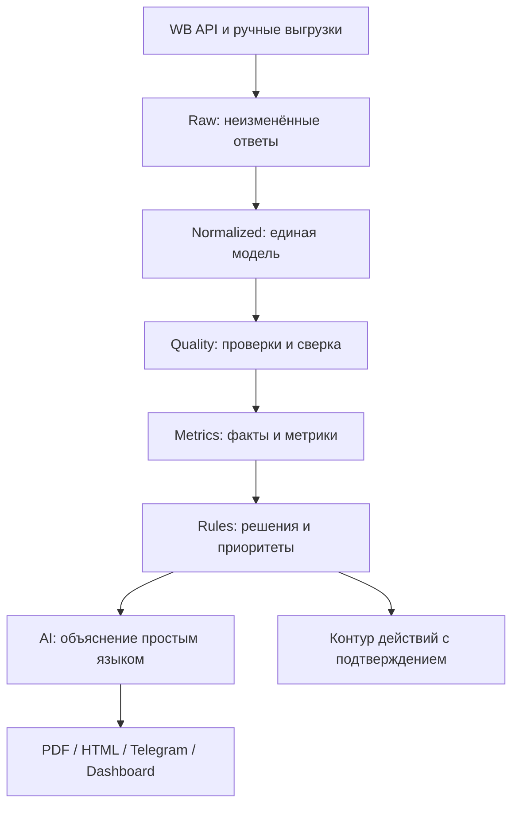

# План реализации оцифровки кабинета Wildberries в Codex

Версия: 1.0  
Дата: 13 июля 2026  
Назначение: пошаговый execution plan для развития проекта «ИИ Директор ВБ» от ежедневного PDF-отчёта до надёжной системы внутренней аналитики и управления кабинетом Wildberries.

## 1. Цель проекта

Система должна ежедневно отвечать владельцу кабинета на пять вопросов:

1. Сколько бизнес реально заработал или потерял?
2. На каких SKU, расходах, кампаниях и этапах воронки возник результат?
3. Где данные неполные, предварительные или противоречат друг другу?
4. Что необходимо сделать сегодня и почему?
5. Какой эффект дали ранее выполненные действия?

Главный принцип: сначала достоверные факты и воспроизводимые формулы, затем рекомендации ИИ, после этого — автоматические действия.

## 2. Зафиксированное состояние текущего отчёта

Уже реализовано:

- ежедневная сводка по заказам, выкупам, рекламе, остаткам и возвратам;
- детализация комиссии, логистики, ребиллинга, хранения, эквайринга, удержаний и себестоимости;
- расчёт прибыли и маржи;
- базовая воронка `переходы → корзина → заказы → выкупы`;
- рекламные показы, клики, CTR, CPC, CPM, ROAS, ROMI и CPO;
- базовый ABC-анализ;
- товары с отрицательной прибылью;
- список действий на день;
- PDF, HTML и текстовое представление отчёта.

Ошибки и ограничения, которые должны быть устранены:

- две разные величины прибыли в одном отчёте; расхождение равно ребиллингу логистики;
- «Потери дня» не учитывают стоимость возвратов и другие денежные потери;
- `заказ → выкуп = 133,33%` смешивает события разных когорт;
- рекламный CTR ошибочно можно принять за CTR всей карточки;
- количество SKU в ABC не совпадает с таблицей C-SKU;
- рекомендация отключить убыточные запросы не подтверждена списком запросов;
- сравнение с предыдущим днём не работает при отсутствии снимка;
- нет единого статуса качества и полноты данных;
- нет детализации экономики по SKU, складу, кампании и запросу;
- нет планирования поставок и контролируемого исполнения действий.

## 3. Целевая архитектура



Рекомендуемый стек, если текущий проект уже не диктует другой:

- Python 3.12;
- FastAPI для API и диагностического интерфейса;
- PostgreSQL для нормализованных фактов, метрик и аудита;
- SQLAlchemy 2 + Alembic;
- Redis + Celery/Dramatiq для очередей, повторов и расписания;
- Pydantic v2 для контрактов;
- httpx для WB API;
- Pandas/Polars только для пакетных расчётов, не как основное хранилище;
- Jinja2 + WeasyPrint или текущий ReportLab для отчётов;
- pytest, respx, Hypothesis и visual regression для тестов;
- Docker Compose для локальной разработки;
- S3-совместимое хранилище для сырых payload и сформированных отчётов.

Если проект уже работает на другом совместимом стеке, не переписывать его ради стека. Сначала выделить границы модулей и закрыть ошибки данных.

## 4. Структура репозитория

```text
wb-digital/
├── AGENTS.md
├── README.md
├── PLAN.md
├── METRICS_PASSPORT.md
├── DATA_SOURCES.md
├── pyproject.toml
├── docker-compose.yml
├── .env.example
├── migrations/
├── src/
│   ├── api/
│   ├── config/
│   ├── wb_client/
│   ├── ingestion/
│   ├── storage/
│   ├── normalization/
│   ├── quality/
│   ├── reconciliation/
│   ├── metrics/
│   ├── recommendations/
│   ├── reports/
│   ├── actions/
│   └── observability/
├── tests/
│   ├── unit/
│   ├── contract/
│   ├── integration/
│   ├── reconciliation/
│   ├── golden/
│   └── visual/
├── fixtures/
│   ├── wb_api/
│   ├── wb_exports/
│   └── expected/
└── docs/
    ├── architecture.md
    ├── source-priority.md
    ├── runbook.md
    └── decisions/
```

## 5. Общие правила разработки в Codex

Перед реализацией создать `AGENTS.md` со следующими обязательными правилами:

- одна задача — один ограниченный контекст и один проверяемый результат;
- не менять формулу метрики без обновления `METRICS_PASSPORT.md` и тестов;
- денежные значения хранить как `Decimal`/`NUMERIC`, никогда как `float`;
- все даты хранить в UTC, бизнес-день рассчитывать в `Europe/Moscow`;
- не смешивать оперативные и финансово-закрытые данные;
- не рассчитывать метрику, если отсутствует обязательный знаменатель;
- `нет данных`, `0` и `не применимо` — разные состояния;
- каждый источник хранить с версией API, временем загрузки и сырым payload;
- повторная загрузка одного периода должна быть идемпотентной;
- любые рекомендации должны содержать доказательство и уровень уверенности;
- автоматические изменения рекламы/цен по умолчанию запрещены;
- перед завершением задачи Codex запускает тесты, линтер, type-check и показывает diff;
- изменения схемы БД сопровождаются миграцией и тестом отката;
- секреты и токены никогда не помещаются в Git, fixtures, логи и отчёты.

Для каждой задачи Codex получает четыре раздела в промпте:

```text
Цель: конкретный измеримый результат.
Контекст: файлы, API, формулы и известная проблема.
Ограничения: что нельзя ломать и какие правила соблюдать.
Готово, когда: команды проверок и ожидаемое поведение.
```

Не давать Codex запрос «реализуй всю оцифровку». Выполнять этапы ниже отдельными задачами и коммитами.

## 6. Этап 0. Зафиксировать базовую версию

### Задачи

1. Импортировать последнюю версию проекта в Git-репозиторий.
2. Создать рабочую ветку `feature/digitalization-foundation`.
3. Сохранить текущий PDF, `facts.json`, `warnings.json`, `report_payload_v2.json`, HTML и email как golden fixtures.
4. Добавить команду, которая воспроизводит текущий отчёт из зафиксированных входных данных.
5. Зафиксировать все текущие формулы в `METRICS_PASSPORT.md`.
6. Добавить `AGENTS.md`, `PLAN.md`, `DATA_SOURCES.md` и журнал архитектурных решений.
7. Настроить единые команды:
   - `make setup`;
   - `make test`;
   - `make lint`;
   - `make typecheck`;
   - `make report-fixture`;
   - `make verify`.

### Готово, когда

- новый разработчик или Codex поднимает проект одной документированной последовательностью;
- текущий отчёт воспроизводится без обращения к WB;
- checksum ключевых fixture-файлов стабилен;
- весь текущий набор тестов проходит.

## 7. Этап 1. Реестр источников WB и версии API

Создать `source_registry`, где для каждого источника указаны:

- домен и endpoint;
- версия API;
- категория токена;
- лимит запросов;
- период доступной истории;
- частота обновления;
- тип данных: оперативные, предварительные или финансово-закрытые;
- естественный ключ записи;
- алгоритм пагинации/курсора;
- политика повторной загрузки;
- дата депрекации;
- резервный источник;
- ответственный набор метрик.

### Первая очередь источников

1. Seller info и каталог карточек.
2. Воронка v3 по товарам и дням.
3. Оперативные заказы и продажи/возвраты.
4. Новые финансовые отчёты Finance API:
   - список отчётов;
   - детализация по `reportId`;
   - отчёты эквайринга.
5. Рекламные кампании, дневная статистика и статистика запросов.
6. Актуальные остатки по складам WB.
7. Платное хранение, приёмка, удержания, замеры и возвраты.
8. Цены, скидки, комиссии и тарифы.
9. Отзывы, вопросы, рейтинг товара — после MVP.

### Критическое решение

Не строить новый финансовый загрузчик вокруг `GET /api/v5/supplier/reportDetailByPeriod`: согласно журналу изменений WB, этот метод отключается 15 июля 2026 года. Создать адаптер новых методов Finance API и отдельный миграционный тест, сравнивающий старый и новый источники на одном закрытом периоде.

### Готово, когда

- для каждой метрики известен первичный источник;
- при изменении версии endpoint меняется адаптер, а не бизнес-логика;
- устаревающий endpoint обнаруживается автоматической проверкой реестра;
- контрактные тесты работают на обезличенных ответах WB.

## 8. Этап 2. Надёжный слой загрузки Raw

### Таблицы/объекты

- `ingestion_run` — запуск загрузки;
- `ingestion_request` — запрос, параметры, HTTP-статус, число попыток;
- `raw_object` — ссылка на неизменённый ответ;
- `ingestion_cursor` — курсор/последняя дата успешной загрузки;
- `source_freshness` — свежесть источника;
- `ingestion_error` — классифицированная ошибка.

### Реализация

1. Общий WB HTTP-клиент с таймаутами, backoff и jitter.
2. Отдельный rate limiter на каждый домен/endpoint.
3. Корректная обработка 401, 403, 404, 429 и 5xx.
4. Идемпотентный ключ загрузки: `seller + source + period + page/cursor + payload hash`.
5. Сохранение raw payload до нормализации.
6. Incremental load плюс регулируемое окно повторной загрузки последних дней.
7. Dead-letter queue для необработанных ответов.
8. Режим replay: пересчитать систему из raw без обращения к API.
9. Ручной импорт официальных ZIP/CSV/XLSX как резервный источник.

### Готово, когда

- повторный запуск не создаёт дубликаты;
- после 429 загрузка продолжается без потери периода;
- любой отчёт можно воспроизвести из сохранённых raw-данных;
- сбой одного источника не блокирует остальные;
- в интерфейсе видно время последнего успешного обновления каждого источника.

## 9. Этап 3. Каноническая модель данных

### Измерения

- `seller`;
- `product` (`nm_id`, артикул продавца, barcode, предмет, бренд);
- `warehouse`;
- `campaign`;
- `search_phrase`;
- `calendar_day`;
- `cost_type`;
- `region`.

### Факты

- `fact_order_event`;
- `fact_sale_event`;
- `fact_return_event`;
- `fact_finance_operation`;
- `fact_funnel_daily`;
- `fact_ad_daily`;
- `fact_ad_phrase_daily`;
- `fact_stock_snapshot`;
- `fact_price_snapshot`;
- `fact_storage_cost`;
- `fact_acceptance_cost`;
- `fact_deduction`;
- `fact_rating_snapshot`.

### Обязательные ключи и правила

- `seller_id` присутствует во всех фактах;
- товар связывается по `nm_id`, а barcode и артикул сохраняются как дополнительные идентификаторы;
- заказ/продажа связываются по `srid`, если источник его предоставляет;
- рекламная запись связывается по `campaign_id + nm_id + date`, запрос — дополнительно по нормализованной фразе/ID кластера;
- финансовая операция хранит `report_id`, тип операции и исходный идентификатор строки;
- деньги — `NUMERIC(18, 2)` или выше;
- количество — отдельное поле, не денежная величина;
- возврат не преобразуется в отрицательную продажу без сохранения исходного типа события;
- исторические названия и категории не перезаписываются без SCD/снимка.

### Готово, когда

- один SKU прослеживается от показа до финансовой операции;
- отсутствующие связи попадают в quarantine, а не теряются;
- повторная нормализация даёт тот же результат;
- миграции разворачиваются на пустой и существующей БД.

## 10. Этап 4. Контроль качества и сверка источников

Ввести статусы данных:

- `complete` — данные полные;
- `partial` — часть источников отсутствует;
- `preliminary` — WB ещё может изменить данные;
- `stale` — данные устарели;
- `conflict` — источники расходятся выше допуска;
- `unavailable` — источник недоступен;
- `not_applicable` — метрика неприменима.

### Проверки

1. Полнота обязательных полей.
2. Уникальность естественных ключей.
3. Непрерывность дат и курсоров.
4. Свежесть каждого источника.
5. Равенство сумм детализации и итогов.
6. Сверка оперативных заказов с воронкой.
7. Сверка продаж/возвратов с финансовым отчётом после закрытия периода.
8. Сверка рекламных итогов с суммой кампаний и запросов.
9. Сверка остатков кабинета с суммой по складам.
10. Контроль невозможных значений: отрицательные показы, CTR > 100%, невалидные даты.
11. Контроль размерности: рубли нельзя складывать со штуками.
12. Контроль состава формулы прибыли во всех представлениях.

### Политика периодов

- «вчера» — календарный день Москвы;
- оперативные данные помечаются предварительными до установленного SLA;
- финансовая прибыль считается окончательной только по закрытым финансовым данным;
- поздние события догружаются окном пересчёта;
- сравнение «вчера/позавчера» показывается только при сопоставимых статусах данных;
- выкуп сегодняшнего дня не делится на сегодняшние заказы как истинная конверсия.

### Готово, когда

- известное расхождение прибыли 219,40 ₽ обнаруживается автоматическим тестом;
- несоответствие количества C-SKU обнаруживается автоматически;
- отчёт не показывает числовую метрику при отсутствии обязательных данных;
- каждая проблема попадает в `warnings.json` с кодом, уровнем и рекомендацией.

## 11. Этап 5. Единый движок метрик

Все формулы реализовать как версионируемые функции. Каждая метрика содержит:

- код и название;
- определение;
- формулу;
- единицу измерения;
- гранулярность;
- обязательные источники;
- политику нулей и пропусков;
- статус качества;
- версию формулы;
- тестовые примеры.

### 11.1 Финансы

Рассчитывать:

- продажи и выручку по финансово признанным операциям;
- комиссию;
- прямую и обратную логистику;
- ребиллинг;
- хранение;
- приёмку;
- эквайринг;
- штрафы и удержания;
- компенсации и корректировки;
- рекламные расходы;
- себестоимость;
- налоги — отдельным настраиваемым слоем;
- валовую прибыль;
- операционную прибыль;
- чистую прибыль;
- маржу и рентабельность.

Создать единый `cost_ledger`. Каждая статья расходов попадает в прибыль один раз. Для рекламы и расходов из разных API сделать правила дедупликации.

### 11.2 Воронка

Отдельно рассчитывать:

- показы карточки;
- переходы в карточку;
- CTR карточки;
- добавления в корзину;
- `карточка → корзина`;
- заказы;
- `корзина → заказ`;
- отмены;
- когортный выкуп;
- возвраты после выкупа.

Рекламные показы и клики не подменяют общую воронку. Метрики явно называются `ad_ctr` и `card_ctr`.

### 11.3 Реклама

- расход, показы, клики, CTR, CPC, CPM;
- заказы, выручка и выкупы с атрибуцией WB;
- CPO, DRR, ROAS;
- маржинальный ROAS и прибыль после рекламы;
- показатели по кабинету, кампании, SKU и запросу;
- сравнение с целевым DRR/CPO;
- доля органических и рекламных заказов;
- lag между кликом, заказом и выкупом.

ROMI не показывать как «истинную прибыль рекламы», если нет маржи атрибутированных продаж и корректного окна атрибуции.

### 11.4 Остатки и поставки

- остаток по SKU/складу;
- средние продажи в день с настраиваемым окном;
- days of cover;
- прогноз даты out-of-stock;
- страховой запас;
- рекомендуемая поставка;
- избыток и неликвид;
- потерянные продажи из-за отсутствия;
- распределение поставки по складам и регионам.

### 11.5 Ассортимент

- ABC по выручке;
- ABC по валовой прибыли;
- XYZ по стабильности спроса;
- объединённая матрица ABC/XYZ;
- отдельные флаги `negative_profit`, `low_margin`, `ad_loss`, `dead_stock`, `stockout_risk`.

ABC рассчитывать только при достаточном периоде и числе SKU. Если данных мало, показывать «недостаточно данных», а не назначать всем категорию C.

### Готово, когда

- одна и та же прибыль используется в шапке, таблице, JSON, HTML и PDF;
- `order_to_buyout` не превышает 100% из-за смешивания дневных событий;
- рекламный и общий CTR невозможно перепутать по названию/источнику;
- сумма SKU совпадает с итогом кабинета в пределах заданного допуска;
- все формулы имеют unit-тесты и примеры в паспорте метрик.

## 12. Этап 6. Канонический payload отчёта

Создать один объект `DailyReportPayload`, из которого строятся все представления.

### Рекомендуемые разделы

1. `meta`: кабинет, дата, время построения, версия отчёта.
2. `data_health`: свежесть, полнота, конфликты, предварительность.
3. `executive_summary`: прибыль, заказы, выкупы, реклама, возвраты, остатки.
4. `comparison`: сопоставимый предыдущий период.
5. `profit`: P&L и мост изменения прибыли.
6. `funnel`: общая и когортная воронка.
7. `advertising`: кабинет, кампании, SKU, запросы.
8. `inventory`: риски дефицита и избытка.
9. `assortment`: ABC/XYZ и убыточные SKU.
10. `actions`: подтверждённые действия.
11. `warnings`: ограничения интерпретации.
12. `lineage`: источники и версии формул для диагностики, скрытые из краткого PDF.

### Исправления текущего PDF

- в шапке использовать тот же `net_profit`, что и в P&L;
- разделить «денежные потери» и «операционные события»;
- стоимость возврата показывать только при рассчитанном денежном эффекте;
- при отсутствии позавчерашних данных писать причину;
- не рисовать пустой график за 7 дней;
- выводить подпись «CTR рекламы»;
- выносить `data_health` в верхнюю часть отчёта;
- для каждой рекомендации выводить SKU/кампанию/запрос и доказательство.

### Готово, когда

- JSON Schema валидирует payload;
- PDF, HTML и Telegram используют один payload без собственных расчётов;
- golden-тест проверяет текущий проблемный пример;
- визуальный тест исключает обрезку, наложение текста и пустые графики.

## 13. Этап 7. Движок рекомендаций

Сначала детерминированные правила, затем ИИ формулирует объяснение. ИИ не вычисляет финансовые факты самостоятельно.

### Формат действия

```json
{
  "action_code": "AD_QUERY_PAUSE_REVIEW",
  "priority": "critical",
  "entity_type": "search_phrase",
  "entity_id": "...",
  "reason": "Расход превысил допустимый CPO, атрибутированных заказов нет",
  "evidence": {},
  "expected_effect": {},
  "confidence": 0.91,
  "requires_approval": true,
  "data_quality": "complete"
}
```

### Первые правила

1. Кампания/запрос расходует бюджет без заказов.
2. DRR выше предела с учётом лага атрибуции.
3. SKU имеет отрицательную маржинальную прибыль.
4. Цена ниже безубыточной.
5. Резкий провал показов, CTR или конверсии относительно собственного baseline.
6. Риск out-of-stock.
7. Избыток/неликвид.
8. Рост возвратов или ухудшение рейтинга.
9. Аномальные удержания/логистика.
10. Несогласованность данных — сначала проверить данные, а не менять бизнес.

### Правила безопасности

- нет доказательства — нет рекомендации;
- `partial/conflict` снижает confidence или блокирует действие;
- ожидаемый эффект не выдаётся с ложной точностью;
- одна проблема не порождает противоречащие действия;
- повторная рекомендация учитывает статус прошлого действия;
- результат принятого действия измеряется до/после на сопоставимом периоде.

### Готово, когда

- совет отключить запрос появляется только вместе с конкретным запросом и данными;
- рекомендации стабильны при повторном расчёте;
- каждая рекомендация имеет тест положительного и отрицательного сценария;
- ИИ-текст не противоречит структурированным фактам.

## 14. Этап 8. Dashboard и детализация

Минимальные экраны:

1. Здоровье данных.
2. Сводка кабинета и P&L.
3. SKU: экономика и воронка.
4. Реклама: кампании → SKU → запросы.
5. Остатки и поставки по складам.
6. ABC/XYZ и ассортимент.
7. Центр действий и история результата.
8. Журнал загрузок и ошибок.

PDF остаётся ежедневным каналом для собственника, dashboard — местом расследования причины.

### Готово, когда

- из любой красной метрики можно перейти к детализации;
- фильтры кабинета, периода и SKU применяются ко всем связанным блокам;
- пользователь видит источник, время обновления и статус данных;
- выгрузка CSV повторяет показанную детализацию.

## 15. Этап 9. Контур контролируемых действий

Порядок внедрения:

1. `observe` — система только рекомендует.
2. `draft` — готовит изменение, но не отправляет его в WB.
3. `approve` — пользователь подтверждает каждое действие.
4. `guarded_auto` — автоматизация только белого списка безопасных правил.

Для каждого действия хранить:

- кто/что инициировал;
- исходное состояние;
- предлагаемые параметры;
- ограничения безопасности;
- подтверждение;
- ответ WB;
- итоговое состояние;
- возможность компенсации/отката;
- измеренный эффект.

Первые автоматизируемые операции после стабильного MVP:

- пауза/запуск рекламной кампании;
- изменение ставки в пределах лимита;
- корректировка дневного бюджета;
- уведомление о необходимости поставки;
- изменение цены только с минимальной ценой, маржой и ручным подтверждением.

### Готово, когда

- dry-run показывает точный запрос без отправки;
- повтор действия идемпотентен;
- превышение guardrail блокируется;
- каждое изменение доступно в аудите;
- аварийный переключатель отключает всю автоматизацию.

## 16. Этап 10. Тестовая стратегия

### Unit

- все формулы;
- обработка `0/null/not_applicable`;
- временные зоны;
- округление денег;
- классификация ABC/XYZ;
- правила рекомендаций.

### Contract

- Pydantic-схемы для каждого WB endpoint;
- fixtures старой и новой версии ответа;
- тест неизвестных полей без падения;
- тест исчезновения обязательного поля с явной ошибкой.

### Integration

- 429 + retry;
- пагинация;
- частичный сбой;
- повторная загрузка;
- replay из raw;
- миграции БД.

### Reconciliation

- сумма SKU = кабинет;
- сумма кампаний = реклама кабинета;
- сумма статей P&L = чистая прибыль;
- сумма складов = общий остаток;
- закрытый финансовый период сопоставим с официальной выгрузкой WB.

### Golden/Visual

- текущий `report_v2 (22)` как проблемный сценарий;
- прибыль везде одна;
- нет 133,33% как конверсии выкупа;
- нет пустого графика;
- нет несовпадения числа C-SKU;
- PDF корректно рендерится на всех страницах.

### Нагрузочные

- несколько кабинетов;
- десятки тысяч SKU-дней;
- повторный расчёт 90 дней;
- лимиты WB без лавины retry.

## 17. Этап 11. Безопасность и эксплуатация

1. Отдельные токены WB по необходимым категориям и минимальным правам.
2. Шифрование токенов в хранилище секретов.
3. Маскирование Authorization и персональных данных в логах.
4. Ротация токенов без остановки загрузок.
5. Резервное копирование PostgreSQL и raw-хранилища.
6. Retention policy для payload и логов.
7. Метрики: успех загрузок, 429, lag, freshness, conflicts, длительность отчёта.
8. Алерты: источник просрочен, отчёт не построен, сверка не прошла, токен истекает/отозван.
9. Runbook восстановления после сбоя.
10. Раздельные окружения dev/stage/prod.

## 18. Этап 12. Ввод в эксплуатацию

### Фаза A — Shadow mode

- новая система работает параллельно старой;
- ничего не отправляет в WB;
- ежедневно сохраняет сравнение метрик.

### Фаза B — Сверка

- минимум 14 последовательных дней;
- ручная сверка с кабинетом и официальными выгрузками;
- отдельно проверяются дни с возвратами, удержаниями и поздними корректировками.

### Фаза C — Новый отчёт

- переключить PDF/HTML на новый payload;
- старый расчёт оставить временным контрольным контуром;
- отслеживать расхождения.

### Фаза D — Рекомендации

- включить правила;
- собирать принятие/отклонение и результат;
- откалибровать пороги.

### Фаза E — Действия

- начать с draft;
- затем ручное подтверждение;
- guarded automation включать только после статистики успешных действий.

## 19. Очерёдность релизов

### Release 1 — Достоверный отчёт

- единая прибыль;
- корректные периоды;
- data health;
- исправленная воронка;
- согласованный ABC;
- единый payload;
- golden-тест текущего отчёта.

Это первый обязательный релиз. Пока он не готов, новые красивые функции не добавлять.

### Release 2 — SKU и реклама

- экономика по SKU;
- кампании и запросы;
- подтверждённые рекомендации;
- корректная рекламная атрибуция.

### Release 3 — Остатки и поставки

- склады и регионы;
- прогноз дефицита;
- рекомендуемая поставка;
- неликвид.

### Release 4 — Dashboard

- расследование причин;
- фильтры и drill-down;
- журнал качества и действий.

### Release 5 — Управление

- draft операций;
- подтверждение;
- guardrails;
- аудит и измерение эффекта.

## 20. Первые 12 задач для Codex

Каждую задачу выполнять в отдельной ветке/worktree после фиксации репозитория.

1. Провести аудит текущей архитектуры и построить карту `источник → поле → метрика → блок отчёта` без изменения кода.
2. Создать golden fixture по текущему отчёту и тест, воспроизводящий расхождение прибыли.
3. Выделить единый `ProfitStatement` и устранить двойную формулу прибыли.
4. Ввести типы `Money`, `Quantity`, `MetricValue` и статусы отсутствия данных.
5. Добавить `DataQualityStatus`, структурированные warnings и верхний блок здоровья данных.
6. Исправить сравнение периодов и запретить несопоставимые сравнения.
7. Разделить `ad_ctr` и `card_ctr`, добавить lineage источника.
8. Заменить дневной `заказ → выкуп` на когортную модель или пометить как операционное соотношение.
9. Переписать ABC по документированной формуле и устранить расхождение числа SKU.
10. Создать source registry и адаптер новых финансовых методов WB.
11. Добавить рекламную детализацию до кампании/SKU/запроса и доказательные правила.
12. Перевести PDF, HTML и email на единый валидируемый `DailyReportPayload`.

## 21. Шаблон первой задачи для Codex

```text
Работай в режиме Plan. Пока не меняй код.

Цель:
провести аудит текущего проекта «ИИ Директор ВБ» и подготовить карту происхождения данных для report_v2.

Контекст:
- METRICS_PASSPORT.md;
- генератор facts.json/report_payload_v2.json;
- код клиентов WB API;
- report_v2 (22).pdf и входные fixtures;
- PLAN.md, разделы 2, 7, 10 и 11.

Нужно:
1. Для каждого показателя отчёта определить источник, endpoint, поле, период и формулу.
2. Найти места, где прибыль рассчитывается повторно.
3. Найти смешивание оперативных и финансовых данных.
4. Найти метрики без проверки полноты входа.
5. Составить список файлов, которые потребуется изменить.
6. Предложить минимальную последовательность PR.

Ограничения:
- не менять код и данные;
- не предполагать формулу без доказательства из кода;
- явно отметить неизвестные связи;
- учитывать депрекации текущего WB API.

Готово, когда:
- создан docs/data-lineage-audit.md;
- каждая метрика из PDF присутствует в таблице;
- перечислены воспроизводимые дефекты с файлами и тестовыми сценариями;
- предложен план первого маленького PR.
```

## 22. Критерии завершения всей оцифровки

Проект считается реализованным, когда:

- любой итог отчёта раскладывается до исходной операции;
- нет разных значений одной метрики в разных блоках;
- предварительные данные визуально отличаются от закрытых;
- при неполных данных система не выдаёт уверенную рекомендацию;
- P&L сверяется с финансовыми отчётами WB;
- воронка не смешивает несопоставимые когорты;
- реклама анализируется до кампании, SKU и запроса;
- остатки видны по складам и превращаются в план поставок;
- рекомендации доказательны и измеряется их последующий эффект;
- действия имеют подтверждение, guardrails, аудит и аварийное отключение;
- проект воспроизводимо разворачивается, тестируется и восстанавливается.

## 23. Официальные источники

- WB API: https://dev.wildberries.ru/
- Аналитика и воронка: https://dev.wildberries.ru/docs/openapi/analytics
- Отчёты: https://dev.wildberries.ru/docs/openapi/reports
- Маркетинг и продвижение: https://dev.wildberries.ru/docs/openapi/promotion
- Поставки FBW: https://dev.wildberries.ru/docs/openapi/orders-fbw
- Журнал изменений WB API: https://dev.wildberries.ru/ru/release-notes
- Codex best practices: https://learn.chatgpt.com/guides/best-practices
- Codex в IDE: https://learn.chatgpt.com/docs/codex/ide
- AGENTS.md: https://learn.chatgpt.com/docs/agent-configuration/agents-md
- Git worktrees в приложении Codex: https://learn.chatgpt.com/docs/environments/git-worktrees

