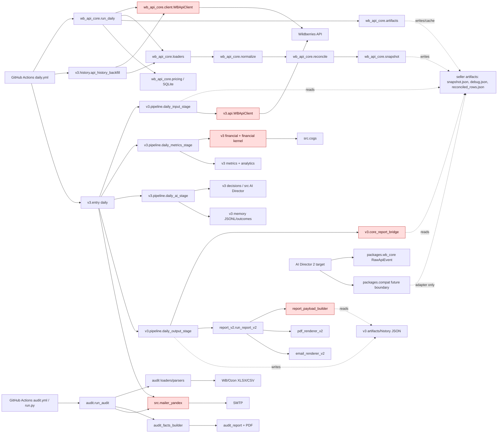
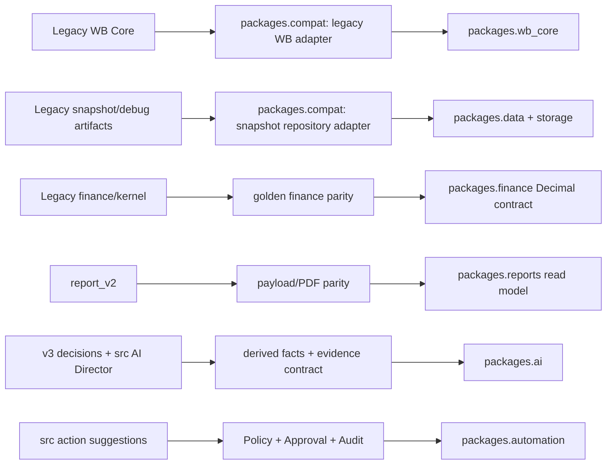

# Legacy Dependency Graph

This graph intentionally shows architectural dependencies, not standard-library imports or every helper function. It is based on static repository inspection on 2026-08-24. Dashed lines indicate a filesystem artifact contract; red nodes identify especially risky migration boundaries.



## Main Runtime Paths

### 1. Scheduled daily report

```text
.github/workflows/daily.yml
  -> python -m wb_api_core.run_daily --seller --date
  -> cabinets/<seller>/artifacts/wb_api_core/<date>/{snapshot,debug,reconciled_rows}.json
  -> python -m wb_api_core.validate_report_snapshot
  -> python -m v3.history.api_history_backfill
  -> python -m v3.entry daily --seller [--date]
  -> input -> metrics -> AI -> output stages
  -> report_v2.pdf / payload / email files / v3 artifacts
```

### 2. Legacy daily route

```text
.github/workflows/v2-daily-manual.yml
  -> python -m src.main
  -> src WB client/facts/metrics/LLM/PDF/SMTP
```

The workflow marks this route as deprecated. It remains a compatibility/runtime consumer until disabled by a reviewed cutover.

### 3. Offline audit route

```text
run.py --mode audit OR .github/workflows/audit.yml
  -> audit.run_audit.run_audit_mode
  -> spreadsheet discovery/parsing
  -> audit facts / Markdown / PDF / optional SMTP
```

## Module-to-External-Service/Data-Format Inventory

| Module family | External services | Input formats | Filesystem/database effects |
| --- | --- | --- | --- |
| `wb_api_core.client/loaders` | WB statistics, finance, analytics, advert, prices, marketplace APIs | JSON list/dict responses | caches, snapshots, raw price JSON, SQLite price database |
| `v3/api`, `v3/ingestion` | WB statistics, analytics, advert APIs | JSON list/dict responses | v3 artifacts/debug through pipeline |
| `v3/sources/wb_reports_loader` | none required for local path | XLSX/CSV/ZIP-like spreadsheet inputs | unpacked/input inspection and debug artifacts |
| `v3/history`, `v3/memory` | WB core backfill indirectly; none for memory | JSON/JSONL | seller history, memory, outcomes |
| `report_v2` | none | snapshot/debug/artifact JSON | JSON payload, PDF, HTML/text email files |
| `src/openrouter_client` | OpenRouter-compatible LLM endpoint | JSON | LLM result/debug route in older main |
| `src/mailer_yandex` | SMTP | PDF bytes | external email delivery |
| `audit` | optional SMTP only | XLSX/CSV/ZIP/JSON inputs | facts/actions/Markdown/PDF |

## High-Coupling and Hidden Dependencies

| ID | Relationship | Why it matters |
| --- | --- | --- |
| DC-01 | `v3.pipeline.daily_stage_support.sync_from_entry` -> `v3.entry` globals | Stage code gets undeclared runtime symbols; extract stages only after explicit imports/contracts exist |
| DC-02 | `v3.core_report_bridge` -> seller filesystem snapshot/debug | New platform must replace paths with a repository/object-storage interface |
| DC-03 | `report_v2.report_payload_builder` -> sibling artifacts/history paths | The passed snapshot is not the entire input contract; fixture must declare secondary inputs |
| DC-04 | `v3.metrics.financial_kernel` -> `src.cogs` | Finance move would otherwise import legacy code from a target package |
| DC-05 | `v3.outputs.email_sender_orchestrator` -> `src.mailer_yandex` | Notification transport crosses legacy package boundary |
| DC-06 | `v3.analysis.ai_director`, analytics alias modules -> `src/*` | Code ownership is split between v3 and older src modules |
| DC-07 | `v3` and `wb_api_core` both implement WB client layers | Must consolidate through compatibility adapters, not add a fourth client |

## Cycles

No static Python import cycle was established. Runtime cycles remain `UNKNOWN` because `sync_from_entry` dynamically injects names and because report builder behavior depends on discovered files.

## Migration Boundary Graph



The direction is intentionally one-way: target packages may call explicit compat adapters during migration, but they must not depend on arbitrary legacy imports.
